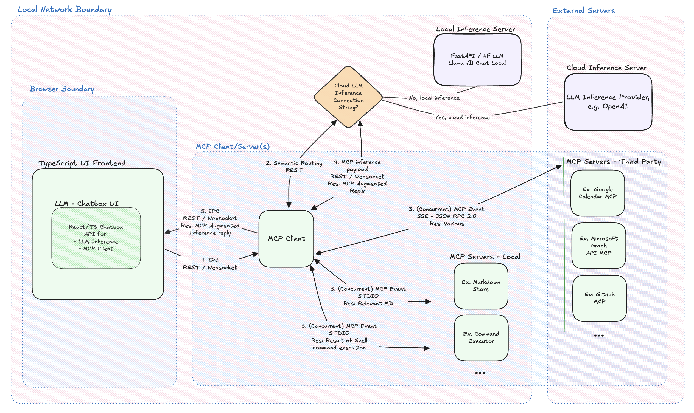

# MCP Client-Server Sandbox for LLM Augmentation

## Overview

**Under Development**

_mcp-scaffold_ is a minimal sandbox for validating Model Context Protocol (MCP) servers against a working LLM client and live chat interface. The aim is minimal friction when plugging in new MCP Servers and evaluating LLM behavior.

At first a local LLM, such as LLaMA 7B is used for local network only testing capabilties. Next, cloud inference will be supported, so devs can use more powerful models for validation without complete local network sandboxing. LLaMA 7B is large (~13GB in common HF format), however, smaller models lack the conversational ability essential for validating MCP augmentation. That said, LLaMA 7b is a popular local LLM Inference model with over 1.3m downloads last month (Mar 2025).

With chatbox UI, LLM inference options in place, MCP Client and a couple demo MCP servers will be added. This project serves as both a reference architecture and a practical development environment, evolving alongside the MCP specification.

## Architecture

  

